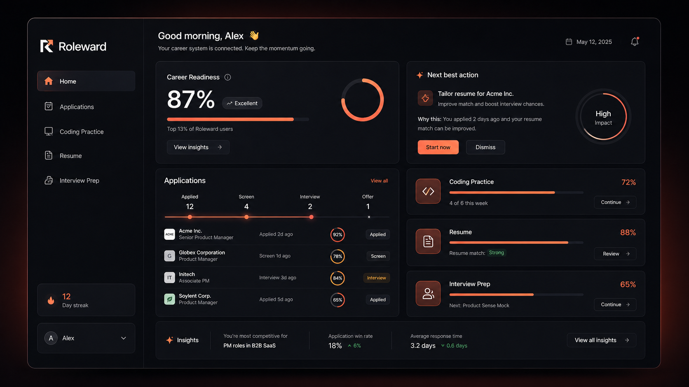
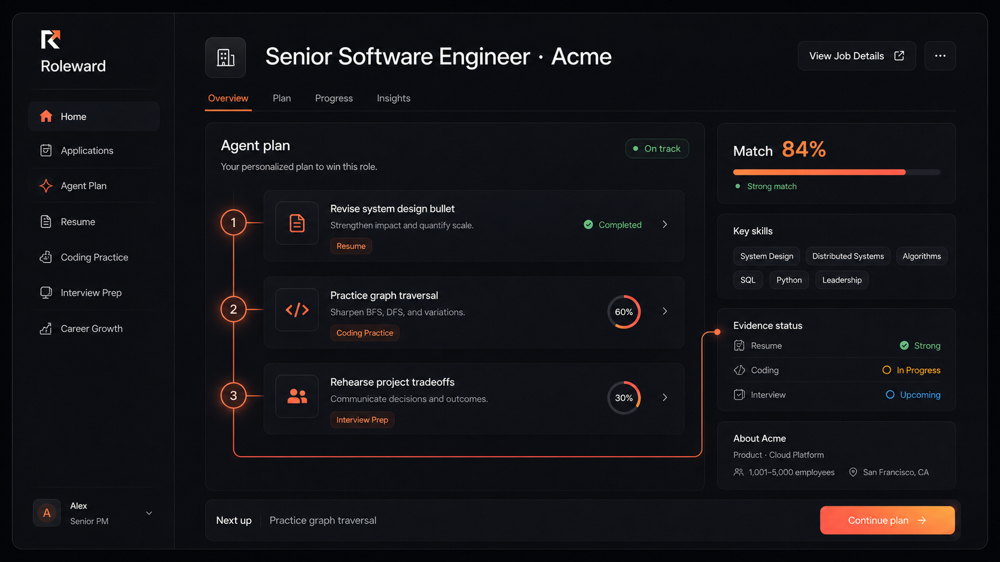

<div align="center">
  <a href="https://roleward.org">
    
  </a>

# Roleward

**Your entire job search. One contextualized AI workspace.**

Roleward connects job applications, AI resume tailoring, coding interview
practice, and mock interviews so every recommendation understands the role you
want and the work you have already completed.

[Open Roleward](https://roleward.org) · [How it works](https://roleward.org/how-it-works) · [Pricing](https://roleward.org/pricing)
</div>

---

## Use Roleward

Roleward is a product for software engineers like you! Available at **[roleward.org](https://roleward.org)**.

This repository is maintained as a public product reference. It is not an
open-source distribution, no open-source license is granted, and local or
self-hosted deployments are not documented or supported. To use Roleward,
create an account through the official website.

## One place for the work behind the offer

<p align="center">
  <a href="https://roleward.org">
    
  </a>
</p>

Most job searches are scattered across application trackers, resume files,
coding platforms, and interview notes. Roleward brings those workflows into one
career preparation system with shared context.

```text
Target job + applications + verified experience
                       ↓
              shared career context
                       ↓
   resume tailoring · coding · mock interviews
                       ↓
               one useful action next
```

## What Roleward connects

| Workspace          | What it helps you do                                                                                                                |
| ------------------ | ----------------------------------------------------------------------------------------------------------------------------------- |
| **Applications**   | Save job postings, confirm role requirements, track application progress, and keep preparation attached to the correct opportunity. |
| **Resume Kitchen** | Review and tailor resumes with AI suggestions grounded in verified experience and visible source evidence.                          |
| **Zed**            | Practice LeetCode-style coding interviews, test solutions, request progressive hints, and improve technical communication.          |
| **Stage Fright**   | Run behavioral and role-specific mock interviews, rehearse follow-ups, and turn feedback into stronger stories.                     |
| **Readiness plan** | Connect activity across every workspace and surface the highest-value preparation step for the target role.                         |

## One role, one preparation route

<p align="center">
  <a href="https://roleward.org/how-it-works">
    
  </a>
</p>

Roleward keeps the target job at the center. Resume revisions close specific
evidence gaps, coding sessions focus on relevant patterns, and interview
practice draws from the decisions and outcomes the candidate can actually
defend.

## Product principles

- **Evidence before generation.** Resume suggestions use experience the
  candidate has confirmed.
- **Keep the original.** Imported resumes remain intact while tailored versions
  are created separately.
- **Coach rather than answer.** Coding and interview tools strengthen reasoning,
  communication, and delivery.
- **Explain the next step.** Preparation guidance shows why an action matters to
  the target role.
- **One target, shared context.** Applications, resumes, coding practice, and
  mock interviews contribute to the same preparation route.

---

<div align="center">
  <strong>Move forward. Go further.</strong><br />
  <a href="https://roleward.org">roleward.org</a>
</div>
