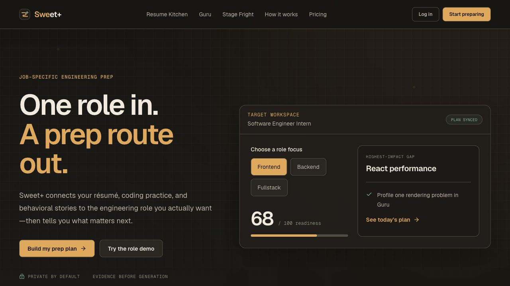
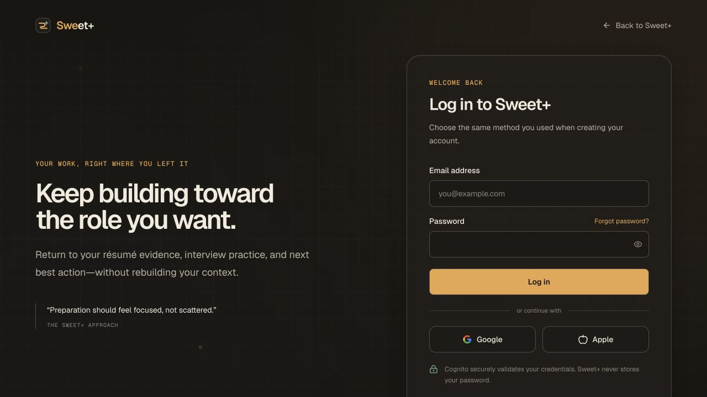
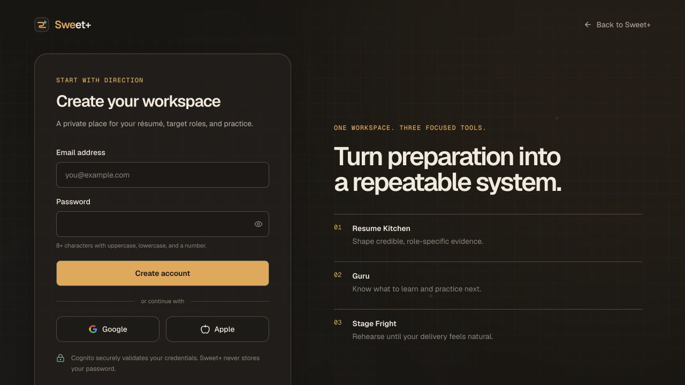

<div align="center">
  

# Backstage

**A calmer, more connected way to prepare for the role you want.**

Backstage brings résumé tailoring, technical practice, and behavioral rehearsal
into one focused workspace built around each target job.

[](https://sweetplus.vercel.app)


[Explore the app](https://sweetplus.vercel.app) · [Product specification](docs/PRODUCT_SPEC.md) · [Roadmap](docs/ROADMAP.md)
</div>

---

## The product at a glance

<p align="center">
  <a href="https://sweetplus.vercel.app">
    
  </a>
</p>

<p align="center"><sub>A job-specific preparation workspace that keeps the next useful action visible.</sub></p>

<table>
  <tr>
    <td width="50%">
      
    </td>
    <td width="50%">
      
    </td>
  </tr>
  <tr>
    <td align="center"><sub><strong>Welcome back</strong> — return to your preparation without rebuilding context.</sub></td>
    <td align="center"><sub><strong>Start with direction</strong> — create one private workspace for all three tools.</sub></td>
  </tr>
</table>

## One workspace, three focused tools

|        | Tool             | Purpose                                                                |
| ------ | ---------------- | ---------------------------------------------------------------------- |
| **01** | **Resume Kitchen**      | Turn verified experience into credible, role-specific résumé evidence. |
| **02** | **Zed**          | Identify technical gaps and organize deliberate interview practice.    |
| **03** | **Stage Fright** | Develop and rehearse behavioral stories until delivery feels natural.  |

Backstage does not promise interviews or offers. It helps candidates understand what a role requires, recognize preparation gaps, and choose the most useful thing to work on next.

## What works today

- Responsive product pages and a private candidate dashboard
- Email/password registration, verification, login, and recovery
- Google authentication through Amazon Cognito
- Server-side sessions with protected workspace routes
- Candidate onboarding and preparation preferences
- Résumé intake with evidence confirmation
- Target-job requirements and readiness mapping
- Dedicated application, evidence, Resume Kitchen, Zed, and Stage Fright workspaces

## Technology

| Layer           | Technology                          |
| --------------- | ----------------------------------- |
| **Application** | Next.js 16, React 19, TypeScript 6  |
| **Interface**   | Tailwind CSS, Geist, Lucide         |
| **Identity**    | Auth.js, Amazon Cognito, AWS SDK    |
| **Validation**  | Zod                                 |
| **Testing**     | Vitest, Testing Library, Playwright |
| **Deployment**  | Vercel                              |

The codebase follows a modular-monolith structure: routes and layouts live in `src/app`, reusable interface components in `src/components`, and product domains in `src/modules`.

```text
src/
├── app/          routes, layouts, and server endpoints
├── components/   product, workspace, and interface components
├── modules/      identity and preparation-domain logic
├── lib/          shared utilities
└── types/        application type extensions
```

## Run it locally

### 1. Requirements

- Node.js 22 or newer
- npm 10
- An Amazon Cognito user pool with a traditional web app client

### 2. Install and configure

```bash
npm install
cp .env.example .env
```

Add the server-only authentication values:

```env
AUTH_SECRET=
AUTH_COGNITO_ID=
AUTH_COGNITO_SECRET=
AUTH_COGNITO_ISSUER=https://cognito-idp.us-east-2.amazonaws.com/YOUR_USER_POOL_ID
NEXT_PUBLIC_APP_URL=http://localhost:3000
```

Generate a secure Auth.js secret:

```bash
openssl rand -base64 32
```

Never prefix authentication secrets with `NEXT_PUBLIC_`, and never commit a populated environment file.

### 3. Start developing

```bash
npm run dev
```

Open [localhost:3000](http://localhost:3000).

## Authentication flow

```text
Email + password ──→ Backstage interface ──→ Cognito validation ──→ Dashboard
Google            ──→ Google consent   ──→ Cognito callback   ──→ Dashboard
```

Email registration, verification codes, login, and password recovery stay inside the Backstage interface. Cognito remains the secure identity store, while Auth.js creates and validates the application session.

| Environment | Cognito callback                                         |
| ----------- | -------------------------------------------------------- |
| Local       | `http://localhost:3000/api/auth/callback/cognito`        |
| Production  | `https://sweetplus.vercel.app/api/auth/callback/cognito` |

See the [authentication setup guide](docs/AUTH_SETUP.md) for app-client settings, OAuth scopes, Google federation, and Vercel environment configuration.

## Quality checks

```bash
npm run lint          # ESLint
npm run typecheck     # TypeScript
npm test              # Unit and component tests
npm run test:e2e      # Playwright flows
npm run format:check  # Prettier
npm run build         # Production build
```

## Documentation

| Document                                      | What it covers                             |
| --------------------------------------------- | ------------------------------------------ |
| [Product specification](docs/PRODUCT_SPEC.md) | Product goals, users, and feature behavior |
| [System architecture](docs/ARCHITECTURE.md)   | Services, modules, and system boundaries   |
| [Data model](docs/DATA_MODEL.md)              | Core entities and relationships            |
| [Delivery roadmap](docs/ROADMAP.md)           | Milestones and implementation sequence     |
| [Authentication setup](docs/AUTH_SETUP.md)    | Cognito, OAuth, callbacks, and deployment  |

---

<div align="center">
  <sub>Built to make serious preparation feel focused, honest, and manageable.</sub>
</div>
