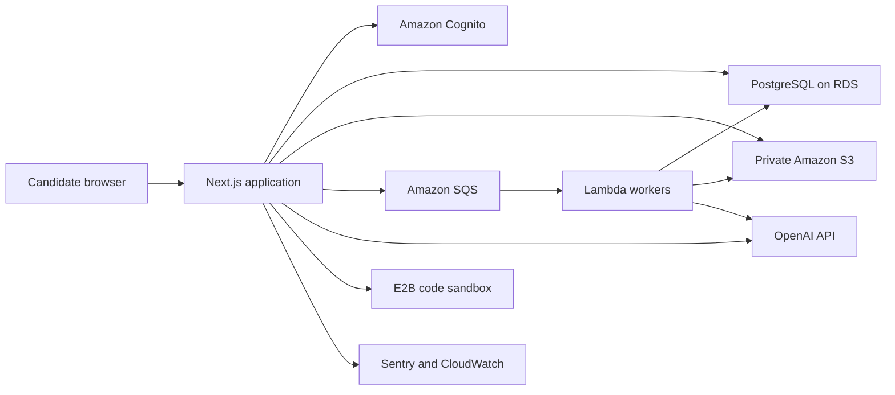
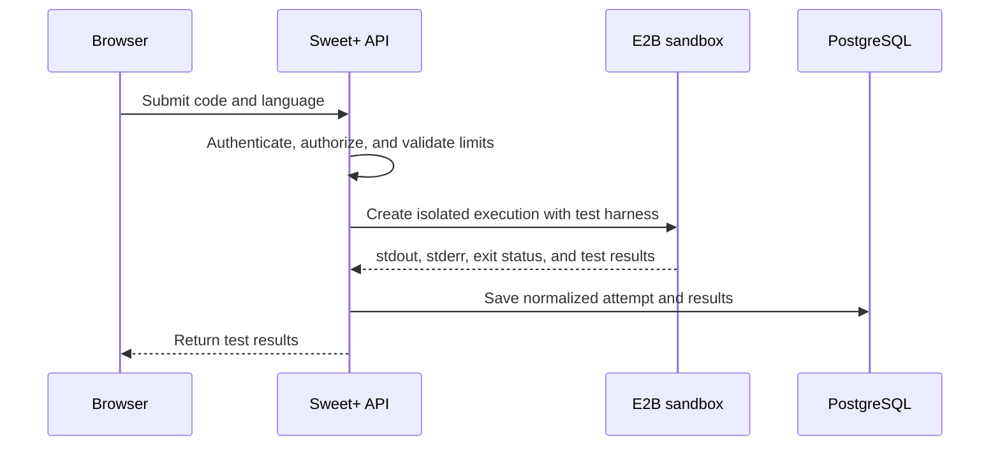

# Sweet+ System Architecture

## 1. Architecture goals

- Ship the MVP with a small engineering team
- Keep sensitive candidate data private and auditable
- Make AI outputs structured, reviewable, and replaceable
- Execute untrusted code outside the application environment
- Support asynchronous document and evaluation workflows
- Keep the core domain portable even when using AWS-managed services
- Scale individual workloads without prematurely adopting microservices

## 2. Architecture style

Sweet+ begins as a **modular monolith** with asynchronous workers.

The Next.js application owns the user interface, authenticated API, domain logic, and orchestration. Domain modules communicate through application services rather than reaching into each other's internals. Long-running or retryable work is published to queues and processed by workers.



## 3. Proposed technology choices

| Concern         | Initial choice             | Reason                                                               |
| --------------- | -------------------------- | -------------------------------------------------------------------- |
| Web application | Next.js + TypeScript       | One language and deployable application for UI and server logic      |
| Components      | Tailwind CSS + shadcn/ui   | Fast, accessible component foundation with full design control       |
| Hosting         | AWS Amplify Hosting        | Managed Next.js hosting that can use existing AWS credits            |
| Authentication  | Amazon Cognito             | Managed identity within the AWS account                              |
| Relational data | PostgreSQL on Amazon RDS   | Natural fit for connected candidate, job, attempt, and evidence data |
| Database access | Drizzle ORM                | Typed schema and migrations close to SQL                             |
| Object storage  | Amazon S3                  | Private resume and export storage                                    |
| Queue           | Amazon SQS                 | Durable asynchronous job handoff and retries                         |
| Workers         | AWS Lambda                 | Event-driven document and AI processing                              |
| AI integration  | Vercel AI SDK + OpenAI API | Streaming and schema-oriented AI integration                         |
| Code execution  | E2B                        | Isolated execution for untrusted candidate submissions               |
| Observability   | Sentry + CloudWatch        | Application errors, infrastructure logs, and operational alerts      |
| Infrastructure  | AWS CDK                    | Version-controlled AWS resources in TypeScript                       |

## 4. Domain modules

```text
src/
  modules/
    identity/
    candidates/
    evidence/
    applications/
    resume-kitchen/
    guru/
    stage-fright/
    readiness/
    planning/
    billing/
  platform/
    database/
    storage/
    queues/
    ai/
    execution/
    telemetry/
```

### Identity

Maps Cognito identities to internal users and enforces account-level authorization.

### Candidates and evidence

Owns user-confirmed career facts. Other modules may reference evidence but may not silently change it.

### Applications

Owns target jobs, job-description snapshots, application stages, deadlines, and requirement records.

### Resume Kitchen

Owns resume documents, versions, sections, bullet suggestions, and evidence-to-requirement explanations.

### Guru

Owns problems, test cases, submissions, execution results, hint events, topic mastery, and interview sessions.

### Stage Fright

Owns stories, competency coverage, practice sessions, feedback, and stage progression.

### Readiness

Reads recorded signals from the other domains and produces explainable, versioned readiness assessments.

### Planning

Converts readiness gaps, deadlines, and availability into limited daily and weekly recommendations.

## 5. Request patterns

### Synchronous requests

Use synchronous server operations for:

- Reading dashboards and application workspaces
- Updating profile or evidence records
- Saving resume edits
- Starting a coding execution
- Streaming an interactive coaching response

### Asynchronous jobs

Use SQS-backed jobs for:

- Resume parsing
- Job-description extraction
- Full resume analysis
- Readiness recalculation after large changes
- Post-session behavioral evaluation
- Resume export
- Email notifications

Every job must include:

- Stable job ID
- User and resource ownership identifiers
- Job type and schema version
- Idempotency key
- Attempt count
- Created timestamp

Workers must support retries without duplicating user-visible results. Failed jobs move to a dead-letter queue and become visible to operators.

## 6. AI architecture

### AI responsibilities

AI is appropriate for:

- Extracting candidate evidence for user confirmation
- Extracting job requirements for user confirmation
- Matching semantically related requirements and evidence
- Drafting resume revisions
- Producing coaching dialogue
- Evaluating qualitative aspects of explanations and stories
- Proposing preparation actions

AI does not directly control:

- Authorization
- Subscription access
- Code correctness
- Test results
- Readiness levels
- Application statuses
- Data deletion

### AI gateway

All model requests go through an internal AI gateway module. The rest of the product does not call provider SDKs directly.

The gateway is responsible for:

- Prompt-template versions
- Schema validation
- Model selection
- Timeouts and retries
- Rate limits and quotas
- Token and cost logging
- Redaction policy
- Evaluation traces
- Provider replacement

### Structured output contract

AI extraction and evaluation responses must validate against versioned schemas. Invalid responses are retried or marked failed; they are never silently stored as valid domain data.

Each stored AI artifact records:

- Provider and model identifier
- Prompt version
- Output schema version
- Input resource IDs
- Token usage and estimated cost
- Creation timestamp
- User acceptance or correction, where relevant

### Prompt-injection boundary

Resumes and job descriptions are untrusted content. They must be placed in clearly delimited data sections and never treated as system instructions. Extracted URLs or instructions must not cause tools, network requests, or data access automatically.

## 7. Secure code execution

Candidate code must never run inside Next.js, Lambda, or the primary AWS account runtime.

Execution flow:



Required controls:

- Execution timeout
- Memory and output limits
- Language allowlist
- Dependency restrictions
- No application secrets in the sandbox
- No direct database or S3 credentials
- Per-user rate limits
- Server-held private tests
- Output truncation
- Sandbox destruction after the session

AI feedback is generated from normalized code and test results after execution. AI opinion never overrides objective test results.

## 8. File handling

- S3 buckets remain private.
- Browser uploads use short-lived presigned URLs.
- Object keys use generated IDs, not user-provided filenames.
- File type is verified from content as well as extension.
- Upload size is limited.
- Malware scanning is introduced before public launch.
- Parsed text is stored separately from the source document.
- Downloads use short-lived authorization.
- Account deletion removes both database records and stored objects.

## 9. Authentication and authorization

- Cognito provides identity; PostgreSQL holds application profiles.
- Every owned record includes `user_id` directly or through a verifiable parent.
- Authorization is enforced server-side for every mutation and private read.
- Object-level checks happen before issuing S3 URLs or starting jobs.
- Administrative operations use separate roles and auditable paths.
- Development, staging, and production use separate AWS environments.

## 10. Readiness calculation

Readiness is a versioned rules engine, not a raw LLM score.

```text
Recorded evidence and activity
          -> normalized signals
          -> versioned readiness rules
          -> level plus explanations
```

Example technical signals:

- Topic coverage
- Recency
- Timed versus untimed completion
- Test correctness
- Hint usage
- Explanation and complexity rubric results

An AI evaluator may contribute rubric observations, but the rules engine owns the final level and its explanation.

## 11. Observability and cost controls

Track:

- API latency and error rate
- Queue depth and oldest job age
- Worker failures and dead-letter jobs
- OpenAI requests, tokens, cost, and schema failures
- Code-execution count, duration, failure, and cost
- Resume-processing duration
- Readiness recalculation failures

Initial controls:

- AWS budget and anomaly alerts
- OpenAI project usage limits
- Per-user AI quotas
- Per-user code-execution quotas
- Model selection by task complexity
- Cache immutable extraction results by content hash
- Avoid embeddings until normal structured matching is insufficient

## 12. Environments and delivery

Environments:

- Local development
- Shared staging
- Production

CI gates:

- Formatting and linting
- Type checking
- Unit tests
- Database migration validation
- Integration tests
- Dependency and secret scanning
- Production build

Deploy infrastructure and application changes independently. Database migrations must be backward-compatible with the currently deployed application during rollout.

## 13. Scaling path

Do not introduce a service until measurements justify it.

Likely future separations:

1. Code-execution orchestration if Guru load dominates
2. AI evaluation workers if queue volume becomes substantial
3. Document generation if exports require a container runtime
4. Analytics pipeline if transactional reporting becomes expensive

PostgreSQL, S3, and SQS contracts should remain stable as components separate.
