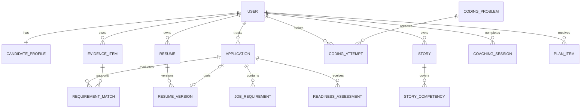

# Sweet+ Core Data Model

## 1. Modeling principles

- PostgreSQL is the source of truth for application state.
- Original resumes and exports live in private object storage.
- User-confirmed evidence is distinct from AI-proposed evidence.
- Job descriptions are snapshotted because source postings can change or disappear.
- AI artifacts are versioned and traceable.
- Readiness results retain their rule version and supporting signals.
- Soft deletion is used for recoverable product records; account deletion triggers permanent removal.

## 2. High-level relationships

## 3. Identity and profile

### `users`

- `id`
- `cognito_subject` — unique external identity
- `email`
- `display_name`
- `timezone`
- `status`
- `created_at`
- `updated_at`
- `deleted_at`

### `candidate_profiles`

- `user_id`
- `track` — internship or new_grad
- `graduation_date`
- `weekly_minutes`
- `preferred_languages`
- `target_role_types`
- `profile_completion`
- timestamps

## 4. Evidence and skills

### `evidence_items`

- `id`
- `user_id`
- `type` — experience, project, education, leadership, other
- `title`
- `organization`
- `summary`
- `start_date`
- `end_date`
- `source_resume_id`
- `verification_status` — proposed, confirmed, corrected, rejected
- timestamps

### `evidence_claims`

Atomic claims prevent the application from treating an entire experience block as equally verified.

- `id`
- `evidence_item_id`
- `claim_type` — action, outcome, metric, technology, responsibility
- `content`
- `verification_status`
- `source_location`
- timestamps

### `skills`

- `id`
- `slug`
- `name`
- `category`

### `evidence_skills`

- `evidence_item_id`
- `skill_id`
- `confidence_source` — explicit, inferred, user_confirmed

## 5. Jobs and applications

### `applications`

- `id`
- `user_id`
- `company_name`
- `role_title`
- `track`
- `location`
- `source_url`
- `status`
- `deadline_at`
- `applied_at`
- timestamps

### `job_description_snapshots`

- `id`
- `application_id`
- `raw_text`
- `content_hash`
- `captured_at`

### `job_requirements`

- `id`
- `snapshot_id`
- `category` — skill, responsibility, qualification, competency
- `importance` — required, preferred, inferred
- `content`
- `user_confirmation_status`
- timestamps

### `requirement_matches`

- `id`
- `requirement_id`
- `evidence_item_id`
- `evidence_claim_id`
- `match_strength`
- `rationale`
- `source` — rules, ai, user
- `user_confirmation_status`
- timestamps

## 6. Resume Kitchen

### `resumes`

- `id`
- `user_id`
- `name`
- `source_object_key`
- `source_media_type`
- `parse_status`
- timestamps

### `resume_versions`

- `id`
- `resume_id`
- `application_id` — nullable for base versions
- `parent_version_id`
- `version_number`
- `content_json`
- `created_by` — import, user, ai_assisted
- timestamps

### `resume_suggestions`

- `id`
- `resume_version_id`
- `requirement_id`
- `evidence_claim_id`
- `original_text`
- `suggested_text`
- `rationale`
- `status` — pending, accepted, modified, rejected
- `accepted_text`
- `ai_artifact_id`
- timestamps

### `resume_exports`

- `id`
- `resume_version_id`
- `format`
- `object_key`
- `status`
- timestamps

## 7. Guru

### `coding_problems`

- `id`
- `slug`
- `title`
- `statement`
- `difficulty`
- `status`
- `supported_languages`
- `constraints_json`
- timestamps

### `coding_topics`

- `id`
- `slug`
- `name`

### `coding_problem_topics`

- `problem_id`
- `topic_id`
- `weight`

### `coding_test_cases`

- `id`
- `problem_id`
- `visibility` — example, public, private
- `input_json`
- `expected_output_json`
- `sort_order`

Private test cases must never be returned to the browser.

### `coding_attempts`

- `id`
- `user_id`
- `application_id` — optional target-job context
- `problem_id`
- `language`
- `source_code`
- `mode` — learn, practice, interview, review
- `started_at`
- `submitted_at`
- `execution_status`
- `tests_passed`
- `tests_total`
- `duration_seconds`

### `coding_execution_results`

- `id`
- `attempt_id`
- `sandbox_provider`
- `exit_status`
- `stdout_truncated`
- `stderr_truncated`
- `runtime_ms`
- `memory_bytes` — when available
- `result_json`
- timestamps

### `hint_events`

- `id`
- `attempt_id`
- `level`
- `content`
- `requested_at`

### `coding_feedback`

- `id`
- `attempt_id`
- `rubric_json`
- `summary`
- `ai_artifact_id`
- timestamps

## 8. Stage Fright

### `stories`

- `id`
- `user_id`
- `evidence_item_id` — optional connection
- `title`
- `situation`
- `task`
- `actions`
- `result`
- `reflection`
- `verification_status`
- timestamps

### `competencies`

- `id`
- `slug`
- `name`
- `description`

### `story_competencies`

- `story_id`
- `competency_id`
- `coverage_strength`
- `source` — ai or user
- `user_confirmation_status`

### `coaching_sessions`

- `id`
- `user_id`
- `application_id`
- `type` — rehearsal or spotlight
- `status`
- `started_at`
- `completed_at`

### `behavioral_turns`

- `id`
- `session_id`
- `role` — coach or candidate
- `content`
- `sequence_number`
- `created_at`

### `behavioral_feedback`

- `id`
- `session_id`
- `story_id`
- `rubric_json`
- `summary`
- `ai_artifact_id`
- timestamps

### `stage_progress`

- `user_id`
- `current_stage`
- `rule_version`
- `supporting_signals_json`
- `updated_at`

## 9. Readiness and planning

### `readiness_assessments`

- `id`
- `application_id`
- `dimension` — application, technical, behavioral
- `level`
- `rule_version`
- `signals_json`
- `explanations_json`
- `calculated_at`

### `preparation_plans`

- `id`
- `user_id`
- `application_id`
- `week_start`
- `available_minutes`
- `status`
- timestamps

### `plan_items`

- `id`
- `plan_id`
- `domain` — resume_kitchen, guru, stage_fright
- `resource_type`
- `resource_id`
- `title`
- `reason`
- `estimated_minutes`
- `priority`
- `scheduled_for`
- `completed_at`

## 10. AI operations

### `ai_artifacts`

- `id`
- `user_id`
- `purpose`
- `provider`
- `model`
- `prompt_version`
- `schema_version`
- `input_references_json`
- `output_json`
- `status`
- `input_tokens`
- `output_tokens`
- `estimated_cost`
- `latency_ms`
- timestamps

Avoid storing full provider request payloads by default because they can duplicate sensitive candidate information. Store resource references, hashes, and only the data required for debugging and audit.

### `async_jobs`

- `id`
- `user_id`
- `type`
- `resource_type`
- `resource_id`
- `idempotency_key`
- `status`
- `attempt_count`
- `error_code`
- `created_at`
- `started_at`
- `completed_at`

## 11. Indexing and constraints

Important constraints:

- Unique `users.cognito_subject`
- Unique job snapshot content hash per application
- Unique resume version number per resume
- Unique idempotency key per job type
- Foreign-key restrictions that prevent cross-user references
- Check constraints for stage, readiness, and application state values

Important indexes:

- All user-owned tables on `user_id`
- Applications on `(user_id, status)`
- Plan items on `(plan_id, scheduled_for)`
- Attempts on `(user_id, submitted_at)`
- Requirements on `snapshot_id`
- Matches on both `requirement_id` and `evidence_item_id`
- AI artifacts on `(user_id, purpose, created_at)`

Embeddings should not be part of the first migration. Add pgvector only after evaluating whether structured matching fails on real, consented test cases.
